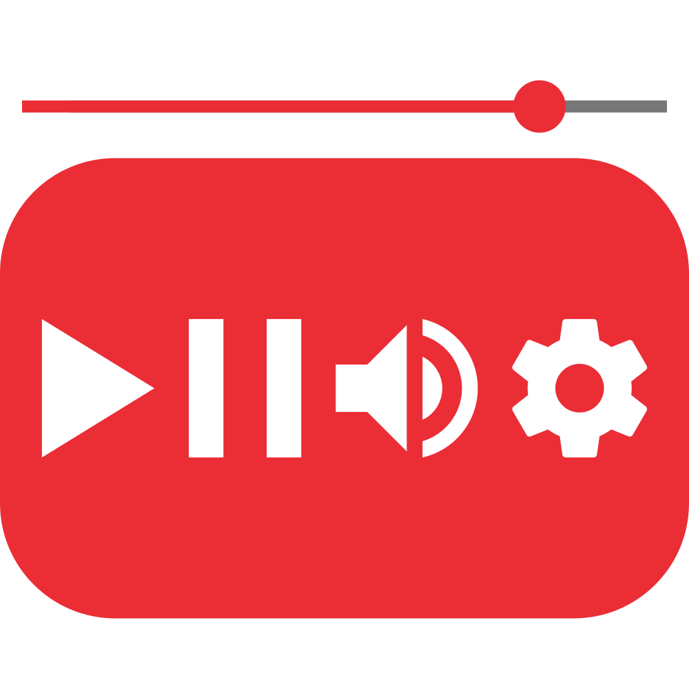
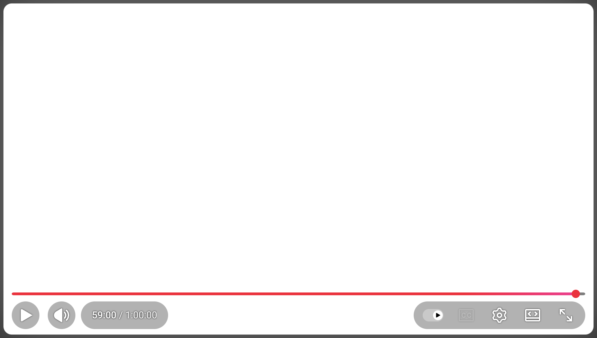
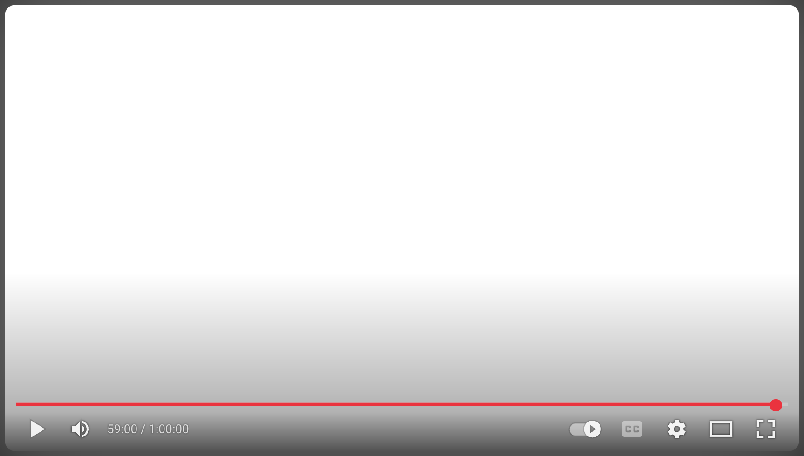
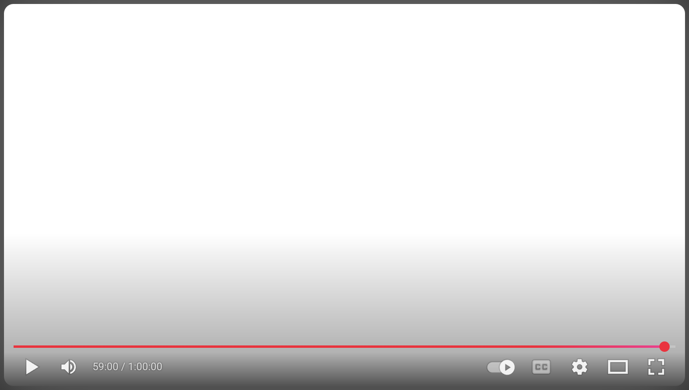

  

# Old School YouTube Player

This is a userstyle that updates YouTube's video player to look & feel before the 2025 redesign.

| Before | After (Userstyle) |
|:-:|:-:|
|  |  |

| Original Design | Userstyle |
|:-:|:-:|
|  |  |

## Features

- [x] Near pixel perfect recreation
- [x] Simple, auditable CSS

## Usage

1. Install a userstyle manager like [Stylus](https://add0n.com/stylus.html)
1. Go to [UserStyles.world](https://userstyles.world/style/24856/old-school-youtube-player) or [GreasyFork](https://greasyfork.org/en/scripts/553724-old-school-youtube-player)
1. Click the install button
1. The userstyle will open in your userstyle manager where you can install it

## Documentation

### Archiving

To help maintain this project and in the spirit of aiding future developers, the HTML of the movie player and the bottom element will be archived periodically.

### Maintenance

This was built with long-term maintenance in mind. All visual assets are locally stored to avoid external dependencies.

Unlike other solutions, this does not rely on JavaScript and **should continue to work** after YouTube removes the old player entirely. However, if YouTube makes significant changes to their player, like deprecating or combining elements, this userstyle does aim to fill those gaps. So it will not be a perfect recreation forever, but it will retain the same look and feel as long as possible within the given constraints of CSS.

This was designed for desktop browsers. I recommend using [Grayjay](https://grayjay.app/) instead of the YouTube site or app on mobile devices.

**Note:** The settings menu is not modified by this userstyle. It's considered outside the scope of this project due to it being a separate, pop-up element and prone to changes video to video and over time by YouTube.

## Background

In 2025, YouTube began A/B testing new updates for their player to better support AR/VR devices. In October, YouTube began a [full rollout](https://support.google.com/youtube/thread/380540176) with no visual option to revert.

## Credit

- Archiving formatter: [Web Formatter](https://webformatter.com/html)
- [Control Panel for YouTube](https://soitis.dev/control-panel-for-youtube) for enabling temporary access to the old player

## Disclaimer

Not affiliated with Alphabet Inc., Google, YouTube, or any of their affiliations.

## Related Projects

Miss the old navigation of GitHub too? Check out my userscript: [GitHub Custom Global Navigation](https://github.com/blakegearin/github-custom-global-navigation#readme)

Miss the old design of Slack too? Check out my userscript: [Old School Slack](https://github.com/blakegearin/old-school-slack#readme)

Want to customize favicons for different YouTube tabs? I'm working on a solution for that too: [Favicon Packs](https://github.com/blakegearin/favicon-packs#readme)
